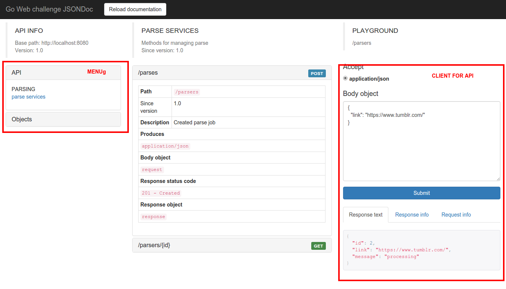

Hi!

I used Go lang and MySQL as storage to complete this task.

You can run my application using docker. I have created container with mysql and my app (for simplifying deployment)

You can build docker container like this (in my application path):

```
docker build -t gotest .
docker run -p 8080:8080 -v `(pwd)`:/go gotest
```

Or you can pull my prepared container

```
docker run -p 8080:8080 -v `(pwd)`:/go metalguardian/gotest
```

Then you can go to the browser [http://localhost:8080/](http://localhost:8080/)

You can see API documentation and clint on the [http://localhost:8080/info/](http://localhost:8080/info/).

Here you can see how to use my application, try api requests and watch results
[](http://localhost:8080/info/)

Or you can run curl queries:

```
curl http://localhost:8080/
#{"message":"Hey! You can use such links","use":["http://localhost:8080/info/"]}
curl -H "Content-Type: application/json" -X POST -d '{"link":"http://google.com.ua/"}' http://localhost:8080/parsers
#{"id":1,"link":"http://google.com.ua/","message":"processing"}
curl http://localhost:8080/parsers/1
```

Known things

1. About separated jobs. I use goroutines, so they don't depend on performance much. Parse requests take ~40ms,
read requests take ~2ms. All grabber tasks do in workers.

2. There is a thing about relative image links on the page. I think they won't work.

3. Application can grab a lot of images, but now I don't implement any queue of grabbing tasks and
now they have no limit per second or some other limitations.
